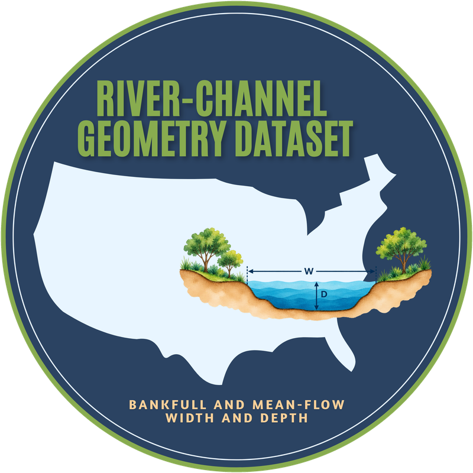

<p align="center">
  
</p>

# Data API

A web API that serves ML-derived bankfull and mean-flow channel geometry for
NHDPlusV2.1 stream reaches and USGS gages across the conterminous United States.

It includes all **2,691,339 reaches** in the release shapefile and **28,164 gages**.
Reaches and gages without a prediction are still returned, with empty width and
depth values, so every COMID you ask for comes back.

Instead of downloading the full 2.5 GB shapefile, users can request just the
reaches or gages they need — by ID, state, HUC2, HUC8, or a polygon — and get
them back as CSV, GeoJSON, or a zipped shapefile.

> **Status:** works locally; public deployment in progress.

This folder is part of the [Bankfull and Mean-flow Channel Geometry for CONUS](../) repository. The code that produced the dataset is in the other folders.

## Data

| Attribute   | Description              | Units |
|-------------|--------------------------|-------|
| `bnk_width` | Bankfull width           | m     |
| `bnk_depth` | Bankfull depth           | m     |
| `mf_width`  | Mean-flow width          | m     |
| `mf_depth`  | Mean-flow depth          | m     |

Reaches also include `comid`, `reachcode`, `state`, `huc2`, `huc8`,
`stream_order`, and `tot_da_sqkm` (total drainage area, km²).
Gages also include `site_no`, `station_nm`, `comid`, `da_sqkm`, `lat`, and `lon`.

- **Paper:** Zarrabi et al. (2025), *Water Resources Research*,
  [doi:10.1029/2024WR037997](https://doi.org/10.1029/2024WR037997)
- **Dataset (latest version):** [Zenodo](https://zenodo.org/records/19208847)
  (doi:10.5281/zenodo.19208847) and
  [HydroShare](https://www.hydroshare.org/resource/1a2e115c212f4f4a80660f94339205e6/), CC-BY-4.0

If you use this data, please cite the paper and the dataset.

## Making a request

Send a `POST` request to `/extract` with a JSON body:

| Field          | Values                                                        |
|----------------|---------------------------------------------------------------|
| `dataset`      | `reach` (default) or `gage`                                   |
| `request_type` | `ids`, `state`, `huc2`, `huc8`, `polygon`, or `conus`         |
| `format`       | `csv` (default), `geojson`, or `shapefile`                    |

Plus the value for your request type: `ids` (COMIDs for reaches, USGS site
numbers for gages), `state` (e.g. `"AL"`), `huc2`, `huc8`, or `polygon`
(a GeoJSON geometry in WGS84).

Examples:

```json
{"dataset": "reach", "request_type": "huc8", "huc8": "03160112", "format": "geojson"}
{"dataset": "gage",  "request_type": "ids",  "ids": ["02465000", "01206900"], "format": "csv"}
```

To use a polygon shapefile instead, upload a zipped shapefile to
`POST /extract/shapefile`. Any coordinate system works as long as the `.prj`
file is included.

Requests returning more than 50,000 records are refused (large HUC2 regions and
all of CONUS). For those, download the full dataset from Zenodo.

Interactive documentation is at `/docs` once the server is running.

## Running it locally

```bash
cd DataAPI
python -m venv venv
source venv/bin/activate
pip install -r requirements.txt
```

Download the reach shapefile and gage CSV from the latest Zenodo record, plus the
[Census state boundaries](https://www2.census.gov/geo/tiger/GENZ2023/shp/cb_2023_us_state_500k.zip),
into this folder. Then build the data files (the reach build takes 10–30 minutes):

```bash
python prepare_data.py gage
python prepare_data.py reach
```

Start the server and open http://127.0.0.1:8000/docs:

```bash
uvicorn app:app --reload
```

To check everything works:

```bash
python test_api.py
```

To try the API without the real data, `python make_sample_data.py` builds a
small fake reach file.

## Files

| File                   | Purpose                                           |
|------------------------|---------------------------------------------------|
| `app.py`               | The API                                           |
| `prepare_data.py`      | Builds `reaches.parquet` and `gages.parquet`      |
| `make_sample_data.py`  | Builds a small fake reach file for testing        |
| `test_api.py`          | Checks every request type                         |
| `requirements.txt`     | Python packages the API needs                     |

## License

Code: MIT (see the repository [LICENSE](../LICENSE)). Data: CC-BY-4.0 (see the Zenodo record).
